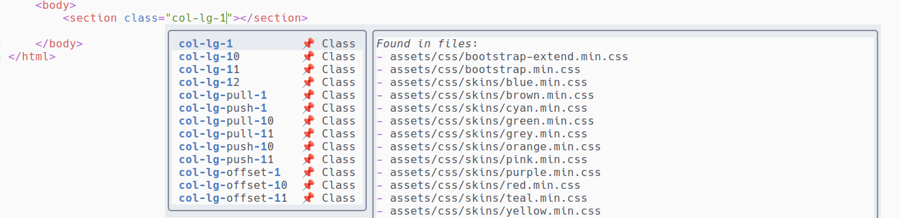

# cmp-html-class

### ⚠️  This repo has been moved ⚠️

This code has been merged to https://github.com/thomas-hiron/cmp-symfony.

---

[nvim-cmp](https://github.com/hrsh7th/nvim-cmp) source for html classes.  
This plugin autocompletes class tags using a pre-generated json file.  



## Prerequisites
A json file must be generated first. It contains one json object
per line, with two keys:
- _class_: the html class to autocomplete
- _files_: a json array containing all files where this class is
defined

Here is an example:
```json
{"class":"my-first-class","files":["/path/to/file.css","/path/to/file.min.css"]}
{"class":"my-second-class","files":["/path/to/file.css"]}
```

## Generate the json file
The file is generated with this bash script:
```bash
temp_dir=$(mktemp -d)

# Get all classes in css files, in json format, then use jq to get all matching
# results and format them: {"class":"my-first-class","file":"/path/to/file.css"}
rg "\.[a-z][a-z0-9-]{3,}" -tcss --no-filename --json assets | jq -c '. 
                                    | select(.type == "match") 
                                    | {class: .data.submatches[].match.text, file: .data.path.text}' > $temp_dir/raw.json

# Sort and uniq input file
cat $temp_dir/raw.json | sort | uniq > $temp_dir/uniq.json

# Group results by class name and add a files key containing all files
cat $temp_dir/uniq.json | jq -sc 'map(. + {data: [{class: [.class], file: [.file]}]})
                                    | group_by(.class)[]
                                    | .[0] + {files: [.[].data[].file | add]}
                                    | del (.data, .file)' > $temp_dir/grouped.json

# Remove trailing dot in class name
sed -i 's/"\./"/' $temp_dir/grouped.json

mv $temp_dir/grouped.json ~/generated_html_classes.json
```

## Setup

```lua
require('cmp').setup({
  sources = {
    { name = 'html_class' },
  },
})
```

## Triggers

The plugin is activated for `twig` and `html` filetypes.  
Autocompletion is triggered for double quotes and space
characters.

## Configuration

There is no configuration at the moment.

## Todo

- Configure filetypes
